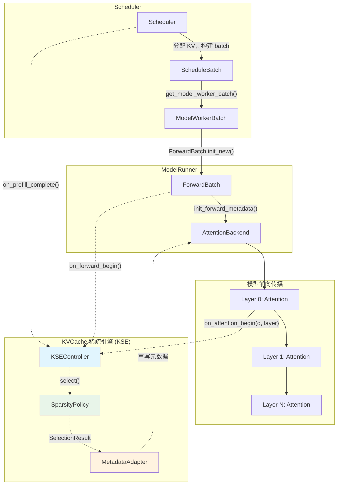
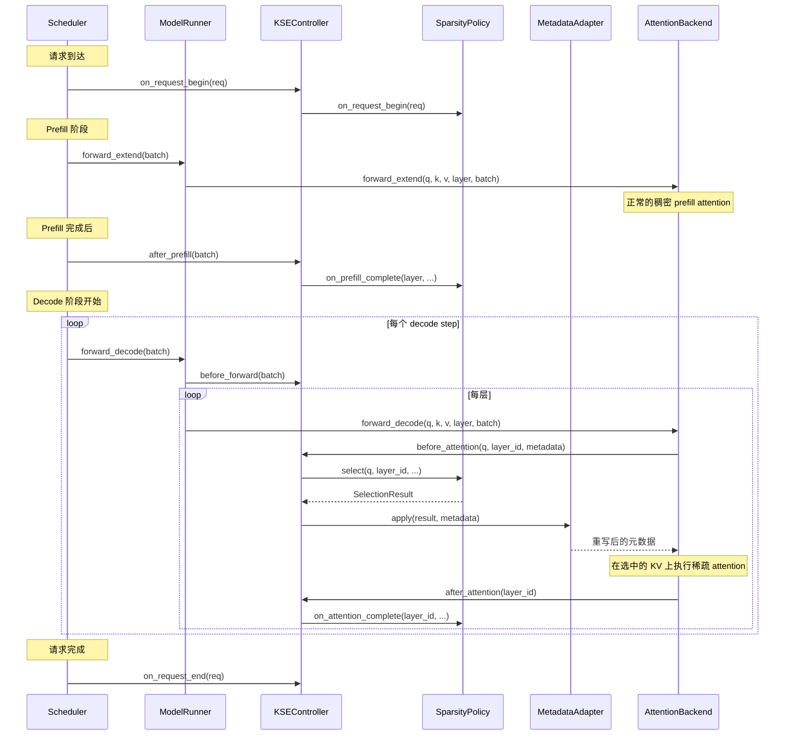

# KVCache 稀疏引擎 (KSE) 设计文档

## 1. 架构概览

### 1.1 问题陈述

随着上下文长度的增长，attention 计算复杂度以 O(n²) 增长，KV Cache 存储需求以 O(n) 线性增长。KVCache 稀疏化技术通过仅选择部分 KV 条目参与 attention 计算来解决这一问题，但 sglang 中现有的实现（Double Sparsity、Hierarchical Sparse 等）与特定后端和算法紧密耦合。本文档提出一个**统一的 KVCache 稀疏引擎 (KSE)**，聚焦于为**不具备原生稀疏注意力机制的模型**提供通用的 KV Cache 稀疏化能力。目标是：

- 支持稀疏化维度（驱逐策略、粒度、频率、选择策略）的任意组合
- 对现有 sglang 前向路径的改动最小化
- 为未来算法提供清晰的扩展点

### 1.2 设计维度

KSE 的设计围绕 KVCache 稀疏化的四个正交维度展开：


| 维度           | 选项                                                                                                                               | KSE 中的对应职责                            |
| ------------ | -------------------------------------------------------------------------------------------------------------------------------- | ------------------------------------- |
| **D1: 保留策略** | 部分保留（仅选择可见子集）/ 全量保留                                                                                                              | `SparsityPolicy.select()` — 选择可见的 KV 子集 |
| **D2: 粒度**   | Token / Block(Page)                                                                                                              | `SelectionResult.granularity` — 选择的单位 |
| **D3: 频率**   | 每请求 / 每 token（decode step）/ 每层                                                                                                   | `SparsityPolicy.frequency` — 何时执行选择   |
| **D4: 策略**   | 固定策略（滑动窗口、sink）/ Query-Unaware（基于 K/V 统计量选择）/ Query-Aware（当前 Query 作为选择输入）/ Attention-Score-Dependent（依赖 attention weights，暂不支持） | `SparsityPolicy.select()` — 如何选择 KV   |


### 1.3 在 sglang 拓扑中的位置

KSE 是一个附加在现有前向路径上的 **sidecar 模块**，在两个明确定义的位置进行拦截：

1. **Scheduler 层**（用于 prefill 后的每请求驱逐）
2. **Attention 层**（用于 decode 阶段的每 token / 每层选择）

无需修改 `AttentionBackend` 基类接口、`KVCache` 或 `ModelRunner.forward()`。KSE 通过在现有后端处理之前**重写 attention 元数据**（page table、seq_lens、mask）来实现功能。




### 1.4 核心设计原则：元数据重写

核心洞察在于：所有 attention 后端（FlashInfer、FlashAttention、Triton）最终都消费**索引数组**（`kv_indices`、`page_table`、`kv_indptr`）和**长度数组**（`seq_lens`、`cache_seqlens`）来决定访问哪些 KV 条目。KSE 不触碰 KV 数据本身 — 仅重写这些元数据数组，使其指向选中的子集。

这意味着：

- **零拷贝** — 对于仅选择（非驱逐）的策略，不产生任何 KV 数据搬运
- **后端无关** — 适用于任何使用分页/索引 KV 访问的后端
- **CUDA Graph 兼容** — 元数据缓冲区可预分配并原地重写

### 1.5 稀疏粒度与后端粒度的兼容性约束

稀疏策略的选择粒度（Token / Page）与 attention 后端的索引粒度之间存在严格的兼容性约束。KSE **不进行**跨粒度的自动转换或退化，而是通过明确的兼容性规则在初始化时进行校验。

**后端索引粒度分类：**

sglang 中的 attention 后端在 KV Cache 的索引方式上分为两类：


| 后端                       | 索引机制                             | 索引粒度      | 说明                                               |
| ------------------------ | -------------------------------- | --------- | ------------------------------------------------ |
| **FlashInfer**           | `kv_indptr` / `kv_indices` (CSR) | **Token** | `kv_indices` 存储每个 token 的物理槽位索引，可任意选择 token 子集   |
| **Triton**               | `kv_indptr` / `kv_indices` (CSR) | **Token** | 同上                                               |
| **FlashAttention (FA3)** | `page_table` / `cache_seqlens`   | **Page**  | `page_table` 中每个 entry 指向一个 page，最小访问单位为完整的 page |


**兼容性规则：**

KSE 执行以下严格的粒度兼容性约束：

> **规则 1：Token 粒度的稀疏策略仅可在 Token 粒度的后端上运行。**

Token 粒度的稀疏策略需要精确控制哪些 token 参与 attention。这仅在使用 CSR 索引（`kv_indices`）的后端上可行——FlashInfer 和 Triton 原生支持，因为 `kv_indices` 中只需填入选中 token 的物理索引即可。注意：部分 Token 粒度算法（如 H2O、SnapKV）因依赖 attention weights 而暂不支持，详见 2.7 节。

对于 Page 粒度的后端（FlashAttention），KSE **不会**采用以下妥协方案，因为每种方案都有不可接受的代价：

- ~~将 `page_size` 设为 1~~：page_size=1 会使 page_table 膨胀到与 token 数量相同，丧失分页带来的内存访问效率（合并读取、TLB 利用率），且部分 FA3 的优化路径（如 CUDA graph 下的 strided 索引）依赖 page_size > 1。
- ~~将 token 级选择向上对齐到 page 边界~~：如果算法精选了 30% 的 token 但 page 对齐后膨胀到 70% 的 page，选择开销仍在但稀疏加速效果大打折扣，得不偿失。

> **规则 2：Page 粒度的稀疏策略可在任何后端上运行，但稀疏 page 大小必须等于后端 page 大小或其整数倍。**

Page 粒度的稀疏策略（如 Quest、ChunkKV）选择的单位是 page。对于 Page 粒度后端，必须满足：

```
sparse_page_size = backend_page_size × N    (N 为正整数)
```

- **N = 1**（稀疏 page 大小 = 后端 page 大小）：最常见的情况。`MetadataAdapter` 直接将选中的逻辑 page 映射为 `page_table` 中的物理 page 索引，零转换开销。
- **N > 1**（稀疏 page 大小 = 后端 page 大小的整数倍）：一个稀疏 page 对应 N 个后端 page。`MetadataAdapter` 将一个稀疏 page 的选择展开为 N 个连续的后端 page。例如 `sparse_page_size=128, backend_page_size=16` 时，选中一个稀疏 page 等于写入 8 个连续的 FA3 page 索引。
- **不允许 sparse_page_size < backend_page_size**：这意味着需要拆分一个后端 page，但后端无法做到——page 是其最小访问单位。
- **不允许 sparse_page_size 不是 backend_page_size 的整数倍**：这会导致稀疏 page 边界与后端 page 边界不对齐，产生部分 page 的读取问题。

对于 Token 粒度后端（FlashInfer、Triton），page 粒度的稀疏策略自然兼容：选中一个 page 等价于将该 page 内所有 token 的索引写入 `kv_indices`。

**兼容性矩阵总结：**


| 稀疏策略粒度    | FlashInfer (Token) | Triton (Token) | FlashAttention (Page)                            |
| --------- | ------------------ | -------------- | ------------------------------------------------ |
| **Token** | 兼容                 | 兼容             | **不兼容**                                          |
| **Page**  | 兼容                 | 兼容             | 兼容（需 sparse_page_size ≥ backend_page_size 且为整数倍） |


**初始化校验：**

`KSEController` 在创建时会执行兼容性校验，不满足约束时直接报错而非静默退化：

```python
def _validate_granularity_compatibility(
    self, policy: SparsityPolicy, backend_name: str, config: KSEConfig
):
    backend_granularity = _get_backend_granularity(backend_name)
    policy_granularity = policy.granularity()

    if policy_granularity == Granularity.TOKEN and backend_granularity == Granularity.PAGE:
        raise ValueError(
            f"Token-granularity sparse policy '{config.policy_name}' is incompatible "
            f"with page-granularity backend '{backend_name}'. "
            f"Use a token-granularity backend (FlashInfer, Triton) instead."
        )

    if policy_granularity == Granularity.PAGE and backend_granularity == Granularity.PAGE:
        backend_page_size = _get_backend_page_size(backend_name)
        if config.page_size < backend_page_size:
            raise ValueError(
                f"Sparse page_size ({config.page_size}) < backend page_size "
                f"({backend_page_size}). Must be >= and an integer multiple."
            )
        if config.page_size % backend_page_size != 0:
            raise ValueError(
                f"Sparse page_size ({config.page_size}) is not an integer multiple "
                f"of backend page_size ({backend_page_size})."
            )
```

---

## 2. 核心抽象与接口

### 2.1 SelectionResult

任何稀疏策略的通用输出，描述哪些 KV 条目应保留用于 attention 计算。

```python
@dataclass
class SelectionResult:
    """稀疏策略 select() 调用的输出。

    所有索引张量使用*逻辑*位置（每个请求序列内从 0 开始的偏移量）。
    MetadataAdapter 通过 req_to_token 将其转换为物理 KV Cache 位置。
    """

    class Granularity(Enum):
        TOKEN = "token"      # 索引为单个 token 位置
        PAGE = "page"        # 索引为 page 索引（乘以 page_size 得到 token 位置）

    granularity: Granularity

    # [batch_size, max_selected] — 逻辑索引，用 -1 填充
    selected_indices: torch.Tensor

    # [batch_size] — 每个请求的实际有效条目数
    valid_lengths: torch.Tensor

    # [batch_size] — 哪些请求实际使用稀疏（其余使用全量 KV）
    sparse_mask: torch.Tensor

    # 可选的逐层覆盖：若设置，仅对这些 layer id 生效
    layer_ids: Optional[List[int]] = None
```

### 2.2 SparsityPolicy（抽象基类）

所有稀疏策略的算法无关接口。

```python
class SparsityPolicy(ABC):
    """所有 KV Cache 稀疏策略的基类。

    一个策略回答一个问题：给定当前状态，哪些 KV 条目应参与 attention 计算？

    生命周期：
        1. __init__()              — 解析配置，分配缓冲区
        2. on_request_begin(req)   — 注册每请求状态
        3. on_prefill_complete()   — 构建初始表征（可选）
        4. select()                — 按频率调用，产生 SelectionResult
        5. on_attention_complete() — 更新表征（可选）
        6. on_request_end(req)     — 清理资源
    """

    class Frequency(Enum):
        PER_REQUEST = "per_request"   # prefill 后执行一次，结果复用于所有 decode step
        PER_STEP = "per_step"         # 每个 decode step 执行一次，跨层共享
        PER_LAYER = "per_layer"       # 每个 decode step 的每层执行一次

    @abstractmethod
    def granularity(self) -> SelectionResult.Granularity:
        """该策略的选择粒度。用于初始化时与后端进行兼容性校验。"""
        ...

    @abstractmethod
    def frequency(self) -> "SparsityPolicy.Frequency":
        """该策略的 select() 需要以什么频率被调用？"""
        ...

    @abstractmethod
    def select(
        self,
        query: Optional[torch.Tensor],
        layer_id: int,
        req_pool_indices: torch.Tensor,
        seq_lens: torch.Tensor,
        forward_batch: ForwardBatch,
        **kwargs,
    ) -> SelectionResult:
        """产生一组 KV 条目的选择结果。

        Args:
            query: [batch, num_heads, head_dim]，对于不含 Query 的策略可为 None。
            layer_id: 当前层索引。
            req_pool_indices: [batch] req_to_token_pool 中的索引。
            seq_lens: [batch] 当前序列长度。
            forward_batch: 完整的 batch 上下文。

        Returns:
            描述哪些 KV 参与 attention 的 SelectionResult。
        """
        ...

    def on_request_begin(self, req) -> None:
        """当新请求进入系统时调用。"""
        pass

    def on_request_end(self, req) -> None:
        """当请求完成或中止时调用。"""
        pass

    def on_prefill_complete(
        self,
        layer_id: int,
        req_pool_indices: torch.Tensor,
        seq_lens: torch.Tensor,
        k_buffer: torch.Tensor,
        v_buffer: torch.Tensor,
        forward_batch: ForwardBatch,
    ) -> None:
        """在每层的 prefill attention 之后调用。构建初始表征。"""
        pass

    def on_attention_complete(
        self,
        layer_id: int,
        req_pool_indices: torch.Tensor,
        seq_lens: torch.Tensor,
        k_buffer: torch.Tensor,
        v_buffer: torch.Tensor,
        forward_batch: ForwardBatch,
    ) -> None:
        """在每次 decode attention 之后调用。增量更新表征。"""
        pass
```

### 2.3 MetadataAdapter

将 `SelectionResult` 转换为后端特定的元数据重写。

```python
class MetadataAdapter(ABC):
    """将 SelectionResult 适配为后端特定的 attention 元数据。

    每个 attention 后端有自己的元数据格式（FlashInfer 使用
    kv_indptr/kv_indices，FlashAttention 使用 page_table/cache_seqlens，
    Triton 使用 kv_indptr/kv_indices）。适配器知道如何重写这些结构
    以反映稀疏选择。
    """

    @abstractmethod
    def save_dense_metadata(self, forward_metadata: Any) -> None:
        """在任何稀疏重写之前快照原始（稠密）元数据。
        在每次前向传播开始时（第一个稀疏层）调用一次。
        """
        ...

    @abstractmethod
    def apply(
        self,
        result: SelectionResult,
        forward_metadata: Any,
        forward_batch: ForwardBatch,
        layer_id: int,
    ) -> Any:
        """原地重写 forward_metadata 以反映稀疏选择。

        对于非稀疏请求（result.sparse_mask == False），元数据保持不变（稠密 attention）。
        """
        ...

    @abstractmethod
    def restore_dense_metadata(self, forward_metadata: Any) -> None:
        """在稀疏层完成后恢复原始稠密元数据。
        当仅部分层使用稀疏 attention 时调用。
        """
        ...
```

### 2.4 KSEController

连接策略、适配器和前向路径的中央协调器。

```python
class KSEController:
    """KVCache 稀疏引擎的中央协调器。

    管理稀疏策略和元数据适配器的生命周期。
    提供 hook 方法，通过最小的代码改动从现有 sglang 前向路径中调用。

    集成点（现有代码仅需 4 行改动）：
        1. Scheduler.on_prefill_complete()  → controller.after_prefill()
        2. ModelRunner.forward_decode()     → controller.before_forward()
        3. AttentionBackend.forward()       → controller.before_attention()
        4. AttentionBackend.forward()       → controller.after_attention()
    """

    def __init__(
        self,
        policy: SparsityPolicy,
        adapter: MetadataAdapter,
        req_to_token_pool: ReqToTokenPool,
        token_to_kv_pool: KVCache,
        config: KSEConfig,
    ):
        self.policy = policy
        self.adapter = adapter
        self.req_to_token_pool = req_to_token_pool
        self.token_to_kv_pool = token_to_kv_pool
        self.config = config

        # 校验稀疏策略粒度与后端粒度的兼容性（见 1.5 节）
        self._validate_granularity_compatibility(policy, config.backend_name, config)

        # 缓存上一次的 SelectionResult，用于 PER_REQUEST 和 PER_STEP 频率
        self._cached_result: Optional[SelectionResult] = None
        self._cached_step: int = -1
        self._metadata_saved: bool = False

    # ---- Hook: 请求生命周期 ----

    def on_request_begin(self, req) -> None:
        self.policy.on_request_begin(req)

    def on_request_end(self, req) -> None:
        self.policy.on_request_end(req)

    # ---- Hook: Prefill 完成后 ----

    def after_prefill(
        self,
        forward_batch: ForwardBatch,
    ) -> None:
        """在 prefill 完成后调用。触发表征构建。"""
        for layer_id in range(self.config.start_layer, self.config.end_layer):
            k_buf = self.token_to_kv_pool.get_key_buffer(layer_id)
            v_buf = self.token_to_kv_pool.get_value_buffer(layer_id)
            self.policy.on_prefill_complete(
                layer_id,
                forward_batch.req_pool_indices,
                forward_batch.seq_lens,
                k_buf, v_buf,
                forward_batch,
            )

        # 对于 PER_REQUEST 策略，仅计算一次选择
        if self.policy.frequency() == SparsityPolicy.Frequency.PER_REQUEST:
            self._cached_result = self.policy.select(
                query=None,
                layer_id=-1,
                req_pool_indices=forward_batch.req_pool_indices,
                seq_lens=forward_batch.seq_lens,
                forward_batch=forward_batch,
            )

    # ---- Hook: Decode 前向传播之前 ----

    def before_forward(self, forward_batch: ForwardBatch) -> None:
        """在每次 decode 前向传播之前调用。"""
        # 对于 PER_STEP 策略，每步计算一次选择
        if self.policy.frequency() == Frequency.PER_STEP:
            self._cached_result = None  # 将在第一次 attention_begin 时计算
        self._metadata_saved = False

    # ---- Hook: 每层 Attention 之前 ----

    def before_attention(
        self,
        query: torch.Tensor,
        layer_id: int,
        forward_batch: ForwardBatch,
        forward_metadata: Any,
    ) -> Any:
        """在 attention 计算之前调用。返回重写后的元数据。"""
        if not self._should_apply(layer_id, forward_batch):
            return forward_metadata

        # 在第一个稀疏层保存稠密元数据
        if not self._metadata_saved:
            self.adapter.save_dense_metadata(forward_metadata)
            self._metadata_saved = True

        # 获取或计算选择结果
        result = self._get_selection(query, layer_id, forward_batch)

        # 重写元数据
        return self.adapter.apply(result, forward_metadata, forward_batch, layer_id)

    # ---- Hook: 每层 Attention 之后 ----

    def after_attention(
        self,
        layer_id: int,
        forward_batch: ForwardBatch,
    ) -> None:
        """在 attention 之后调用。更新表征。"""
        if not forward_batch.forward_mode.is_decode():
            return
        k_buf = self.token_to_kv_pool.get_key_buffer(layer_id)
        v_buf = self.token_to_kv_pool.get_value_buffer(layer_id)
        self.policy.on_attention_complete(
            layer_id,
            forward_batch.req_pool_indices,
            forward_batch.seq_lens,
            k_buf, v_buf,
            forward_batch,
        )

    # ---- 内部方法 ----

    def _get_selection(
        self, query, layer_id, forward_batch
    ) -> SelectionResult:
        freq = self.policy.frequency()
        if freq == SparsityPolicy.Frequency.PER_REQUEST:
            return self._cached_result
        if freq == SparsityPolicy.Frequency.PER_STEP:
            if self._cached_result is None:
                self._cached_result = self.policy.select(
                    query=query,
                    layer_id=layer_id,
                    req_pool_indices=forward_batch.req_pool_indices,
                    seq_lens=forward_batch.seq_lens,
                    forward_batch=forward_batch,
                )
            return self._cached_result
        # PER_LAYER: 始终重新计算
        return self.policy.select(
            query=query,
            layer_id=layer_id,
            req_pool_indices=forward_batch.req_pool_indices,
            seq_lens=forward_batch.seq_lens,
            forward_batch=forward_batch,
        )

    def _should_apply(self, layer_id, forward_batch) -> bool:
        if not forward_batch.forward_mode.is_decode():
            return False
        if layer_id < self.config.start_layer or layer_id >= self.config.end_layer:
            return False
        return True

```

### 2.5 KSEConfig 与工厂

```python
@dataclass
class KSEConfig:
    """KVCache 稀疏引擎的配置。"""
    policy_name: str                    # 例如 "quest", "h2o", "streaming_llm"
    backend_name: str                   # 例如 "flashattention", "flashinfer", "triton"
    start_layer: int = 0                # 应用稀疏的起始层
    end_layer: int = -1                 # 结束层（不含），-1 表示所有层
    min_seq_len: int = 2048             # 激活稀疏的最小 seq_len
    page_size: int = 64                 # page 粒度策略的 page 大小
    policy_kwargs: dict = field(default_factory=dict)  # 算法特定参数


# ---- 注册表与工厂 ----

_POLICY_REGISTRY: Dict[str, Type[SparsityPolicy]] = {}
_ADAPTER_REGISTRY: Dict[str, Type[MetadataAdapter]] = {}

def register_policy(name: str):
    """装饰器：注册一个 SparsityPolicy 实现。"""
    def wrapper(cls):
        _POLICY_REGISTRY[name] = cls
        return cls
    return wrapper

def register_adapter(name: str):
    """装饰器：注册一个 MetadataAdapter 实现。"""
    def wrapper(cls):
        _ADAPTER_REGISTRY[name] = cls
        return cls
    return wrapper

def create_kse_controller(
    config: KSEConfig,
    req_to_token_pool: ReqToTokenPool,
    token_to_kv_pool: KVCache,
    device: torch.device,
) -> KSEController:
    policy_cls = _POLICY_REGISTRY[config.policy_name]
    adapter_cls = _ADAPTER_REGISTRY[config.backend_name]

    policy = policy_cls(config, device)
    adapter = adapter_cls(device)

    return KSEController(
        policy=policy,
        adapter=adapter,
        req_to_token_pool=req_to_token_pool,
        token_to_kv_pool=token_to_kv_pool,
        config=config,
    )
```

### 2.6 维度覆盖矩阵


| 算法               | D1 驱逐 | D2 粒度 | D3 频率 | D4 策略                                            | KSE 支持状态     |
| ---------------- | ----- | ----- | ----- | ------------------------------------------------ | ------------ |
| **StreamingLLM** | 部分保留  | Token | 每步    | 固定策略（sink + 滑动窗口），仅 mask 不物理驱逐                   | ✅ 支持         |
| **Quest**        | 全量保留  | Page  | 每层    | Query-Aware（当前 Q 与 bounding-box 评分）              | ✅ 支持         |
| **ChunkKV**      | 全量保留  | Page  | 每层    | Query-Aware（当前 Q 与 chunk 评分）                     | ✅ 支持         |
| **H2O**          | 驱逐    | Token | 每步    | Attention-Score-Dependent（历史 attention score 累积） | ❌ 暂不支持       |
| **SnapKV**       | 驱逐    | Token | 每请求   | Attention-Score-Dependent（prefill 阶段观察窗口投票）      | ❌ 暂不支持       |
| **DeepSeek NSA** | 全量保留  | Page  | 每层    | 模型原生（内置学习型 indexer + 专用内核）                       | — 不纳入 KSE 范围 |


**关于 D4 策略类型的分类：**

D4 维度将稀疏策略分为四类，其中前三类为 KSE 当前支持的类型，第四类因后端限制暂不支持：

- **Query-Aware**（含 Query）：`select()` 接收当前 decode step 的 Q 向量，并将其与 KV 的**预计算表征**进行计算以产生选择结果。例如 Quest 用当前 Q 与 page 的 bounding-box 做内积上界估计；ChunkKV 用当前 Q 对 chunk 评分。这类算法的表征（bounding box、chunk 统计量等）可通过 `on_prefill_complete()` 和 `on_attention_complete()` 中的 K/V buffer 直接构建，不依赖 attention weights。
- **Query-Unaware**（不含 Query，不依赖 attention weights）：`select()` 不依赖当前 Q，而是基于预先计算的、不依赖 attention weights 的统计量做选择。例如基于 key 的 L2 范数、位置编码衰减等纯 K/V 统计量的策略。
- **固定策略**：`select()` 不依赖 Q 或 attention weights，仅基于位置规则（如 StreamingLLM 的 sink + 滑动窗口）。每个 decode step 都重新计算窗口范围以跟踪新 token 的加入。
- **Attention-Score-Dependent**（依赖 attention weights，**暂不支持**）：算法的核心逻辑依赖 attention weights（即 softmax(Q·K^T/√d) 的输出）作为输入。例如 H2O 需要在每次 attention 后获取逐 token 的 attention weights 来累积历史重要性分数；SnapKV 需要在 prefill 阶段获取观察窗口内的 attention weights 来投票选出重要 token。此类算法暂不支持的原因详见下文。

**不支持的组合及原因：**

- **物理驱逐（当前不支持）**：KSE 当前仅通过 `select()` 的 mask 控制 token 可见性，不物理释放 KV Cache 槽位。原因是 sglang 的 scheduler 通过 `Req.kv_committed_len` 跟踪每个请求的 KV 分配量，而 model runner 侧无法安全地修改此字段。如果 KSE 调用 `allocator.free()` 释放槽位但不同步 `kv_committed_len`，请求结束时 radix cache 会再次释放相同槽位，导致 double-free 和内存泄漏检测报错。未来可在 scheduler 层面集成物理驱逐。
- **依赖 Attention Weights 的算法（H2O、SnapKV 等）暂不支持**：
  sglang 的所有 attention 后端（FlashInfer、FlashAttention/FA3、Triton）均为**融合内核（fused kernel）**实现。融合内核采用 FlashAttention 的 tiling 算法，在 SRAM 中分块计算 softmax 并直接输出 attention output，**不在 global memory 中物化完整的 attention weights 矩阵**。这是融合内核实现高性能的根本原因——避免了 O(n²) 的中间矩阵读写。
  融合内核在计算过程中维护的唯一统计量是 **LSE（Log-Sum-Exp）**，即 log∑exp(q·k/√d)。LSE 是 online softmax 算法的必要中间状态，所有后端均支持返回（FlashInfer 的 `run(return_lse=True)`、FlashAttention 的 `return_softmax_lse=True`），且返回开销几乎为零。但 LSE 是一个 **per-head 标量** `[batch, num_heads]`，仅反映整体 attention "能量"，**无法区分单个 KV token 的贡献**。
  要获取逐 token 的 attention weights，只有两种途径，均不可接受：
  1. **使用非融合的 attention 实现**：即显式计算 `softmax(Q @ K^T / √d)`，产生 `[batch, num_heads, 1, seq_len]` 的 attention weights 矩阵。这需要 O(n) 的额外 global memory 读写（decode 阶段 Q 长度为 1），且无法利用融合内核的 tiling 优化，会显著降低 attention 性能。
  2. **修改融合内核**：在 FlashAttention tiling 循环内部增加 attention weights 的写出逻辑。这不仅需要修改上游内核代码（FlashInfer、FA3），还会因额外的 global memory 写入破坏内核的内存带宽优化，影响所有用户（包括不使用稀疏的场景）。
  因此，KSE 当前**不提供** attention weights 作为策略的输入。`on_prefill_complete()` 和 `on_attention_complete()` 的参数仅包含 K/V buffer，不包含 attention weights。依赖 attention weights 的算法（H2O、SnapKV 等）需要等待后续支持方案（如利用 block-level LSE 近似、或策略内部自行计算 Q·K^T 等替代方案）成熟后再纳入框架。

**关于 Cluster 等其他粒度不纳入支持的说明：**

KSE 仅支持 Token 和 Page 两种选择粒度，暂不支持 Cluster（如基于 k-means 聚类的语义分组）等其他粒度。原因如下：

1. **与现有内存管理架构不兼容**：sglang 的整个 KV Cache 内存体系（`ReqToTokenPool`、`TokenToKVPoolAllocator`、`PagedTokenToKVPoolAllocator`）建立在"token 为基本单位、page 为物理分组"的两级索引之上。`req_to_token` 按序列位置顺序映射 token 到 KV 槽位，page 是连续 token 的物理打包。Cluster 粒度要求按语义相似性而非位置顺序对 token 分组，这与现有的顺序映射机制根本冲突，需要引入额外的 cluster→token 间接层。
2. **性能代价不可接受**：Cluster 分组需要在每次选择时维护和查询一个 cluster 到 token 的映射表，这在 attention 的关键路径上引入额外的间接访问和不连续内存读取。更重要的是，attention 后端（FlashInfer、FlashAttention、Triton）的内核均针对连续 page 或 token 索引优化，cluster 产生的不规则访问模式会严重降低 GPU 内存带宽利用率。
3. **可通过现有粒度近似**：实践中，cluster 类方法（如 PQCache 的向量量化）可以在 `SparsityPolicy` 内部维护 cluster 结构作为评分手段，但最终输出仍为 token 或 page 级别的 `SelectionResult`。即：cluster 是策略的内部实现细节，不需要作为框架级粒度暴露。

---

## 3. 工作流实现

### 3.1 整体工作流




### 3.2 具体示例：Quest 算法

Quest 是一个 Query-Aware、Page 粒度、每层频率的稀疏 attention 算法。它为每个 page 维护 key 的 bounding box（min/max），并通过上界估计 attention score 来对 page 评分。

**步骤 1：注册**

```python
@register_policy("quest")
class QuestPolicy(SparsityPolicy):
    def __init__(self, config: KSEConfig, device: torch.device):
        self.page_size = config.page_size
        self.sparsity_ratio = config.policy_kwargs.get("sparsity_ratio", 0.7)
        self.num_recent_pages = config.policy_kwargs.get("num_recent_pages", 4)
        self.page_k_min = {}   # layer_id -> [num_pages, num_heads, head_dim]
        self.page_k_max = {}
        self.page_valid = {}
        ...

    def frequency(self) -> SparsityPolicy.Frequency:
        return SparsityPolicy.Frequency.PER_LAYER
```

**步骤 2：在 prefill 时构建表征**

```python
    def on_prefill_complete(self, layer_id, req_pool_indices, seq_lens,
                            k_buffer, v_buffer, forward_batch):
        # 对每个请求，计算每个 page 的 key min/max
        num_pages = seq_lens // self.page_size
        for i, req_idx in enumerate(req_pool_indices):
            token_indices = req_to_token[req_idx, :seq_lens[i]]
            keys = k_buffer[token_indices]  # [seq_len, num_heads, head_dim]
            # 重塑为 [num_pages, page_size, num_heads, head_dim]
            paged_keys = keys[:num_pages[i] * self.page_size].view(
                num_pages[i], self.page_size, -1, keys.shape[-1]
            )
            phys_pages = token_indices[::self.page_size][:num_pages[i]] // self.page_size
            self.page_k_min[layer_id][phys_pages] = paged_keys.amin(dim=1)
            self.page_k_max[layer_id][phys_pages] = paged_keys.amax(dim=1)
            self.page_valid[layer_id][phys_pages] = True
```

**步骤 3：decode 阶段的每层选择**

```python
    def select(self, query, layer_id, req_pool_indices, seq_lens,
               forward_batch, **kwargs) -> SelectionResult:
        bs = query.shape[0]
        all_indices = []
        all_lengths = []

        for i in range(bs):
            num_pages = seq_lens[i] // self.page_size
            # 对每个 page 评分：通过 bounding box 计算 q·k 的上界
            q_i = query[i]  # [num_heads, head_dim]
            k_min = self.page_k_min[layer_id][:num_pages]
            k_max = self.page_k_max[layer_id][:num_pages]
            scores = torch.where(q_i >= 0, q_i * k_max, q_i * k_min).sum(dim=(-2, -1))

            # 选择 top-k pages + 最近的 pages
            k = int(num_pages * self.sparsity_ratio)
            topk = scores.topk(k).indices
            recent = torch.arange(num_pages - self.num_recent_pages, num_pages)
            selected = torch.cat([topk, recent]).unique().sort().values
            all_indices.append(selected)
            all_lengths.append(len(selected))

        # 填充并堆叠
        max_len = max(all_lengths)
        indices = torch.full((bs, max_len), -1, dtype=torch.int32)
        for i, sel in enumerate(all_indices):
            indices[i, :len(sel)] = sel

        return SelectionResult(
            granularity=SelectionResult.Granularity.PAGE,
            selected_indices=indices,
            valid_lengths=torch.tensor(all_lengths, dtype=torch.int32),
            sparse_mask=seq_lens >= self.config.min_seq_len,
        )
```

**步骤 4：MetadataAdapter 重写 page_table**

以 FlashAttention 后端为例：

```python
@register_adapter("flashattention")
class FlashAttentionAdapter(MetadataAdapter):
    def apply(self, result, forward_metadata, forward_batch, layer_id):
        if result.granularity == SelectionResult.Granularity.PAGE:
            # 重写 page_table：仅保留选中的 pages
            for i in range(result.selected_indices.shape[0]):
                if not result.sparse_mask[i]:
                    continue
                n_sel = result.valid_lengths[i]
                logical_pages = result.selected_indices[i, :n_sel]
                # 通过 req_to_token 将逻辑 page 索引映射为物理 pages
                phys_pages = self._logical_to_physical(
                    logical_pages, forward_batch, i
                )
                forward_metadata.page_table[i, :n_sel] = phys_pages
            # 更新 cache_seqlens 以反映缩减后的 KV 长度
            forward_metadata.cache_seqlens_int32 = torch.where(
                result.sparse_mask,
                result.valid_lengths * forward_batch.token_to_kv_pool.page_size,
                forward_metadata.cache_seqlens_int32,
            )
        return forward_metadata
```

### 3.3 具体示例：StreamingLLM（Masking-only 策略）

StreamingLLM 保留固定数量的 "sink" token（初始 token）加上一个滑动窗口的最近 token。随着每个 decode step 产生新 token，窗口向前滑动，超出窗口的 token 被 mask 掉。

**设计要点：**

1. **频率为 PER_STEP**：每个 decode step 都调用 `select()` 重新计算 sink + 窗口的 token 集合，确保 attention 只看到正确的 token 范围。
2. **仅 mask，不物理驱逐**：被 mask 的 token 仍占用 KV Cache 物理槽位，直到请求结束由 radix cache 统一释放。这避免了与 scheduler 的 `Req.kv_committed_len` 簿记冲突。
3. **开销分析**：`select()` 每步仅做简单的 arange + cat，开销极低。主要收益来自 attention 计算量的减少（只对选中的 token 做 attention）。

```python
@register_policy("streaming_llm")
class StreamingLLMPolicy(SparsityPolicy):
    def __init__(self, config: KSEConfig, device: torch.device):
        self.num_sink_tokens = config.policy_kwargs.get("num_sink_tokens", 4)
        self.window_size = config.policy_kwargs.get("window_size", 1024)

    def frequency(self) -> Frequency:
        return Frequency.PER_STEP

    def select(self, query, layer_id, req_pool_indices, seq_lens,
               forward_batch, **kwargs) -> SelectionResult:
        # 每步选择 sink tokens + 最近 window_size 个 token
        # 中间的 token 被 mask 掉（不参与 attention，但物理 KV 槽位不释放）
        for i in range(bs):
            n = seq_lens[i]
            if n <= num_sink_tokens + window_size:
                selected = arange(0, n)  # 全部保留
            else:
                sink = arange(0, num_sink_tokens)
                window = arange(n - window_size, n)
                selected = cat([sink, window])
        ...
```

### 3.4 现有代码中的集成点

KSE 在现有 sglang 代码库中仅需 **4 个最小插入点**：


| 位置                                  | 改动             | 代码                                                                      |
| ----------------------------------- | -------------- | ----------------------------------------------------------------------- |
| `Scheduler.run_batch()`             | Prefill 完成后    | `if kse: kse.after_prefill(forward_batch)`                              |
| `ModelRunner.forward_decode()`      | 模型前向之前         | `if kse: kse.before_forward(forward_batch)`                             |
| `AttentionBackend.forward_decode()` | Attention 内核之前 | `if kse: metadata = kse.before_attention(q, layer_id, batch, metadata)` |
| `AttentionBackend.forward_decode()` | Attention 内核之后 | `if kse: kse.after_attention(layer_id, batch)`                          |


无需修改 `AttentionBackend` 基类、`KVCache`、`ReqToTokenPool`、`ForwardBatch` 或任何模型代码。

---

## 4. 可扩展性与性能

### 4.1 框架定位：聚焦于无原生稀疏注意力的模型

KSE 的设计目标是为**不具备原生稀疏注意力机制的模型**提供通用的 KV Cache 稀疏化能力。这意味着 KSE 主要服务于使用标准稠密 attention 的模型（如 LLaMA、Qwen、Mistral 等），通过在推理阶段附加稀疏策略来减少 attention 计算量和 KV Cache 内存占用。

**不纳入 KSE 范围的模型原生稀疏注意力：**

部分模型在架构层面内置了稀疏注意力机制（如 DeepSeek NSA），其稀疏模式由模型内部的学习型模块决定，并配合专用的高性能内核（如 TileLang/Triton 实现的 sparse MLA）执行。这类模型原生稀疏注意力**不纳入 KSE 的管理范围**，原因如下：

1. **已有高度优化的专用实现**：模型原生稀疏注意力通常配备专用的 attention 后端（如 sglang 中的 `NSABackend`），这些后端针对特定的稀疏模式和元数据格式进行了深度优化，性能远优于通用框架的元数据重写方案。
2. **与模型架构深度耦合**：原生稀疏的 indexer 作为模型前向传播的一部分运行，使用中间隐藏状态（而不仅仅是 Q 向量）来决定稀疏模式。将其纳入 KSE 的 `SparsityPolicy` 抽象会引入不必要的间接层，且无法与模型架构完全解耦。
3. **元数据格式不兼容**：原生稀疏注意力使用专有的元数据格式（如 NSA 的 `page_table_1`、`real_page_table`、`nsa_cache_seqlens` 等），与 KSE 基于通用 page table / kv_indices 重写的机制不匹配。

因此，KSE 与模型原生稀疏注意力是**互补**而非替代的关系：原生稀疏注意力由模型自身的专用后端处理，KSE 则为标准稠密 attention 模型提供可插拔的稀疏化能力。

### 4.2 选择开销分析

KSE 引入的主要开销是 `SparsityPolicy.select()` 中的**选择计算**。按频率分析如下：


| 频率          | 每 decode step 的开销   | 摊销方式                |
| ----------- | ------------------- | ------------------- |
| PER_REQUEST | 0（在 prefill 时计算一次）  | 完全摊销到所有 decode step |
| PER_STEP    | 1 × select()        | 跨所有层共享              |
| PER_LAYER   | N_layers × select() | 无摊销 — 每步承担全部开销      |


**定量估算**（Quest，PER_LAYER，batch_size=32，seq_len=8K，page_size=64）：

- 每请求的 page 数：128
- Score 计算：32 × 128 次 [num_heads, head_dim] 矩阵乘 ≈ 0.1ms（A100）
- Top-k 选择：32 × topk(128) ≈ 0.01ms
- 元数据重写：page_table scatter ≈ 0.02ms
- **总计：每层约 0.13ms**，而 8K 长度下全量 attention 约 0.5ms
- **净加速**：attention 从 0.5ms 降至约 0.2ms（稀疏），每层净收益约 0.17ms

### 4.3 优化策略

**1. 融合选择内核**

对于 PER_LAYER 策略，选择开销在关键路径上。将 score 计算和 top-k 融合为单个 Triton 内核，可消除内核启动开销和中间内存分配：

```python
@triton.jit
def fused_page_score_topk_kernel(
    query_ptr, k_min_ptr, k_max_ptr, output_indices_ptr,
    num_pages, k, BLOCK_SIZE: tl.constexpr,
):
    # 在一次 pass 中计算 bounding-box score 并选择 top-k
    ...
```

**2. PER_STEP 缓存选择**

对于 PER_STEP 策略，选择仅计算一次并跨所有层复用。`KSEController._cached_result` 机制确保零冗余计算。例如 StreamingLLM 的 `select()` 每步仅做 `arange` + `cat`（sink + window），计算量极低。

**3. CUDA Graph 兼容性**

元数据重写操作的是预分配的张量（`page_table`、`kv_indptr`、`cache_seqlens`），这些张量已经是 CUDA Graph 捕获的一部分。适配器执行原地更新，使其与 CUDA Graph 回放兼容，无需重新捕获。

**4. 异步表征更新**

对于在 attention 后更新表征的算法（例如 Quest 为新 token 更新 page bounding box），更新可以与同一层的 MLP 计算使用 CUDA stream 重叠：

```
Layer L: [Attention] → [KSE 更新 (异步)] → [MLP]
                         ↓ (重叠)
Layer L: [Attention] → [MLP + KSE 更新在 alt stream 上]
```

**5. 批量化选择**

当前 `select()` 中的逐请求循环是瓶颈。使用填充张量和掩码操作的批量化实现可消除 Python 循环：

```python
# 批量 page 评分：[batch, num_pages, num_heads, head_dim]
scores = torch.where(q.unsqueeze(1) >= 0,
                     q.unsqueeze(1) * k_max_batched,
                     q.unsqueeze(1) * k_min_batched).sum(dim=(-2, -1))
topk_indices = scores.topk(k, dim=1).indices  # [batch, k]
```

### 4.4 内存开销

KSE 本身引入的内存开销极小：


| 组件                   | 内存                      | 备注                                                      |
| -------------------- | ----------------------- | ------------------------------------------------------- |
| `SelectionResult` 张量 | O(batch × max_selected) | 跨步复用                                                    |
| 稠密元数据快照              | O(batch × max_pages)    | page_table 的一份拷贝                                        |
| 策略表征                 | 取决于算法                   | Quest: O(num_pages × num_heads × head_dim × num_layers) |


以 Quest 为例，100K pages、8 heads、128 dim、80 layers：表征约 8GB。可通过跨 GQA 组共享表征或使用低精度（FP16 → FP8）来减少。