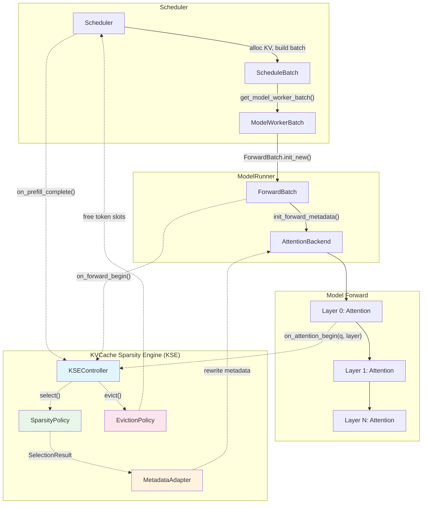
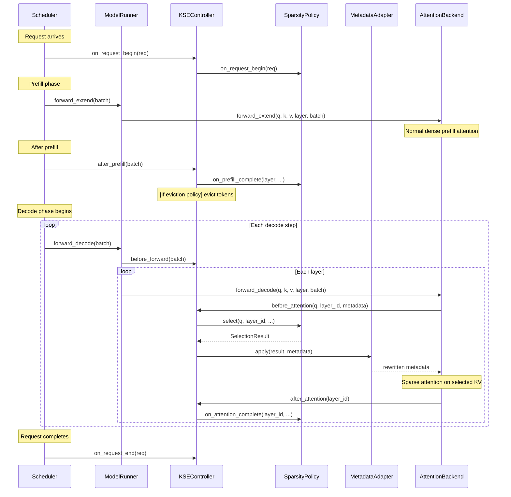

# KVCache Sparsity Engine (KSE) Design Document

## 1. Architecture Overview

### 1.1 Problem Statement

As context lengths grow, attention computation scales O(n²) and KV cache memory scales O(n). KVCache sparsity techniques address this by selecting a subset of KV entries for attention, but existing implementations in sglang (Double Sparsity, NSA, Hierarchical Sparse) are tightly coupled to specific backends and algorithms. This document proposes a **unified KVCache Sparsity Engine (KSE)** that:

- Supports arbitrary combinations of sparsity dimensions (eviction policy, granularity, frequency, selection strategy)
- Minimally modifies the existing sglang forward path
- Provides a clean extension point for future algorithms

### 1.2 Design Dimensions

The KSE design is driven by four orthogonal dimensions of sparse KVCache:

| Dimension | Options | KSE Responsibility |
|---|---|---|
| **D1: Eviction** | Partial retain (evict) / Full retain (select) | `EvictionPolicy` — whether to physically free KV slots |
| **D2: Granularity** | Token / Block(Page) / Cluster | `SelectionResult.granularity` — unit of selection |
| **D3: Frequency** | Per-request / Per-token(decode step) / Per-layer | `SparsityPolicy.frequency` — when selection runs |
| **D4: Strategy** | Fixed (sliding window, sink) / Query-unaware / Query-aware | `SparsityPolicy.select()` — how to choose KV |

### 1.3 Position in sglang Topology

The KSE is a **sidecar module** attached to the existing forward path. It intercepts at two well-defined points:

1. **Scheduler level** (for per-request eviction after prefill)
2. **Attention level** (for per-token / per-layer selection during decode)

No changes to `AttentionBackend` base interface, `KVCache`, or `ModelRunner.forward()` are required. The KSE operates by **rewriting attention metadata** (page tables, seq_lens, masks) before the existing backend processes them.



### 1.4 Key Design Principle: Metadata Rewriting

The core insight is that all attention backends (FlashInfer, FlashAttention, Triton) ultimately consume **index arrays** (`kv_indices`, `page_table`, `kv_indptr`) and **length arrays** (`seq_lens`, `cache_seqlens`) to determine which KV entries to attend to. The KSE does not touch the KV data itself — it only rewrites these metadata arrays to point to the selected subset.

This means:
- **Zero copy** — no KV data movement for selection-only (non-eviction) policies
- **Backend agnostic** — works with any backend that uses paged/indexed KV access
- **CUDA graph compatible** — metadata buffers can be pre-allocated and rewritten in-place

---

## 2. Core Abstractions & Interfaces

### 2.1 SelectionResult

The universal output of any sparsity policy, describing which KV entries to keep for attention.

```python
@dataclass
class SelectionResult:
    """Output of a sparsity policy's select() call.

    All index tensors use *logical* positions (0-based offsets within each
    request's sequence). The MetadataAdapter translates them to physical
    KV cache locations using req_to_token.
    """

    class Granularity(Enum):
        TOKEN = "token"      # indices are individual token positions
        PAGE = "page"        # indices are page indices (multiply by page_size for token pos)

    granularity: Granularity

    # [batch_size, max_selected] — logical indices, padded with -1
    selected_indices: torch.Tensor

    # [batch_size] — actual number of valid entries per request
    valid_lengths: torch.Tensor

    # [batch_size] — which requests actually use sparse (others use full KV)
    sparse_mask: torch.Tensor

    # Optional per-layer override: if set, only apply to these layer ids
    layer_ids: Optional[List[int]] = None
```

### 2.2 SparsityPolicy (Abstract Base)

The algorithm-agnostic interface for all sparsity strategies.

```python
class SparsityPolicy(ABC):
    """Base class for all KV cache sparsity policies.

    A policy answers one question: given the current state, which KV entries
    should participate in attention?

    Lifecycle:
        1. __init__()              — parse config, allocate buffers
        2. on_request_begin(req)   — register per-request state
        3. on_prefill_complete()   — build initial representations (optional)
        4. select()                — called per frequency to produce SelectionResult
        5. on_attention_complete() — update representations (optional)
        6. on_request_end(req)     — cleanup
    """

    class Frequency(Enum):
        PER_REQUEST = "per_request"   # once after prefill, result reused for all decode steps
        PER_STEP = "per_step"         # once per decode step, shared across layers
        PER_LAYER = "per_layer"       # once per layer per decode step

    @abstractmethod
    def frequency(self) -> "SparsityPolicy.Frequency":
        """When does this policy's select() need to be called?"""
        ...

    @abstractmethod
    def select(
        self,
        query: Optional[torch.Tensor],
        layer_id: int,
        req_pool_indices: torch.Tensor,
        seq_lens: torch.Tensor,
        forward_batch: ForwardBatch,
        **kwargs,
    ) -> SelectionResult:
        """Produce a selection of KV entries for attention.

        Args:
            query: [batch, num_heads, head_dim] or None for query-unaware policies.
            layer_id: current layer index.
            req_pool_indices: [batch] indices into req_to_token_pool.
            seq_lens: [batch] current sequence lengths.
            forward_batch: full batch context.

        Returns:
            SelectionResult describing which KV to attend to.
        """
        ...

    def on_request_begin(self, req) -> None:
        """Called when a new request enters the system."""
        pass

    def on_request_end(self, req) -> None:
        """Called when a request completes or is aborted."""
        pass

    def on_prefill_complete(
        self,
        layer_id: int,
        req_pool_indices: torch.Tensor,
        seq_lens: torch.Tensor,
        k_buffer: torch.Tensor,
        v_buffer: torch.Tensor,
        forward_batch: ForwardBatch,
    ) -> None:
        """Called after prefill attention at each layer. Build initial representations."""
        pass

    def on_attention_complete(
        self,
        layer_id: int,
        req_pool_indices: torch.Tensor,
        seq_lens: torch.Tensor,
        k_buffer: torch.Tensor,
        v_buffer: torch.Tensor,
        forward_batch: ForwardBatch,
    ) -> None:
        """Called after each decode attention. Update representations incrementally."""
        pass
```

### 2.3 EvictionPolicy (Optional Mixin)

For algorithms that permanently remove KV entries (D1: partial retain).

```python
class EvictionPolicy(ABC):
    """Mixin for policies that permanently evict KV cache entries.

    Eviction physically frees token slots in TokenToKVPoolAllocator,
    reducing memory pressure but making evicted tokens unrecoverable.
    """

    @abstractmethod
    def compute_eviction(
        self,
        req_pool_indices: torch.Tensor,
        seq_lens: torch.Tensor,
        forward_batch: ForwardBatch,
    ) -> torch.Tensor:
        """Return token positions to evict per request.

        Returns:
            evict_indices: [batch, max_evict] logical token positions, padded with -1
        """
        ...
```

### 2.4 MetadataAdapter

Translates `SelectionResult` into backend-specific metadata rewrites.

```python
class MetadataAdapter(ABC):
    """Adapts SelectionResult into backend-specific attention metadata.

    Each attention backend has its own metadata format (FlashInfer uses
    kv_indptr/kv_indices, FlashAttention uses page_table/cache_seqlens,
    Triton uses kv_indptr/kv_indices). The adapter knows how to rewrite
    these structures to reflect the sparse selection.
    """

    @abstractmethod
    def save_dense_metadata(self, forward_metadata: Any) -> None:
        """Snapshot the original (dense) metadata before any sparse rewriting.
        Called once at the start of each forward pass (first sparse layer).
        """
        ...

    @abstractmethod
    def apply(
        self,
        result: SelectionResult,
        forward_metadata: Any,
        forward_batch: ForwardBatch,
        layer_id: int,
    ) -> Any:
        """Rewrite forward_metadata in-place to reflect the sparse selection.

        For non-sparse requests (result.sparse_mask == False), metadata is
        left unchanged (dense attention).
        """
        ...

    @abstractmethod
    def restore_dense_metadata(self, forward_metadata: Any) -> None:
        """Restore the original dense metadata after sparse layers complete.
        Called if only a subset of layers use sparse attention.
        """
        ...
```

### 2.5 KSEController

The central coordinator that wires policies, adapters, and the forward path.

```python
class KSEController:
    """Central coordinator for the KVCache Sparsity Engine.

    Owns the lifecycle of sparsity policies and metadata adapters.
    Provides hook methods that are called from the existing sglang
    forward path with minimal code changes.

    Integration points (4 lines of change in existing code):
        1. Scheduler.on_prefill_complete()  → controller.after_prefill()
        2. ModelRunner.forward_decode()     → controller.before_forward()
        3. AttentionBackend.forward()       → controller.before_attention()
        4. AttentionBackend.forward()       → controller.after_attention()
    """

    def __init__(
        self,
        policy: SparsityPolicy,
        adapter: MetadataAdapter,
        eviction: Optional[EvictionPolicy],
        req_to_token_pool: ReqToTokenPool,
        token_to_kv_pool: KVCache,
        config: KSEConfig,
    ):
        self.policy = policy
        self.adapter = adapter
        self.eviction = eviction
        self.req_to_token_pool = req_to_token_pool
        self.token_to_kv_pool = token_to_kv_pool
        self.config = config

        # Cache the last SelectionResult for PER_REQUEST and PER_STEP frequencies
        self._cached_result: Optional[SelectionResult] = None
        self._cached_step: int = -1
        self._metadata_saved: bool = False

    # ---- Hook: Request lifecycle ----

    def on_request_begin(self, req) -> None:
        self.policy.on_request_begin(req)

    def on_request_end(self, req) -> None:
        self.policy.on_request_end(req)

    # ---- Hook: After prefill ----

    def after_prefill(
        self,
        forward_batch: ForwardBatch,
    ) -> None:
        """Called after prefill completes. Triggers representation building
        and optional eviction."""
        for layer_id in range(self.config.start_layer, self.config.end_layer):
            k_buf = self.token_to_kv_pool.get_key_buffer(layer_id)
            v_buf = self.token_to_kv_pool.get_value_buffer(layer_id)
            self.policy.on_prefill_complete(
                layer_id,
                forward_batch.req_pool_indices,
                forward_batch.seq_lens,
                k_buf, v_buf,
                forward_batch,
            )

        if self.eviction is not None:
            self._do_eviction(forward_batch)

        # For PER_REQUEST policies, compute selection once
        if self.policy.frequency() == SparsityPolicy.Frequency.PER_REQUEST:
            self._cached_result = self.policy.select(
                query=None,
                layer_id=-1,
                req_pool_indices=forward_batch.req_pool_indices,
                seq_lens=forward_batch.seq_lens,
                forward_batch=forward_batch,
            )

    # ---- Hook: Before forward (decode) ----

    def before_forward(self, forward_batch: ForwardBatch) -> None:
        """Called before each decode forward pass."""
        # For PER_STEP policies, compute selection once per step
        if self.policy.frequency() == SparsityPolicy.Frequency.PER_STEP:
            self._cached_result = None  # will be computed on first attention_begin
        self._metadata_saved = False

    # ---- Hook: Before attention at each layer ----

    def before_attention(
        self,
        query: torch.Tensor,
        layer_id: int,
        forward_batch: ForwardBatch,
        forward_metadata: Any,
    ) -> Any:
        """Called before attention computation. Returns rewritten metadata."""
        if not self._should_apply(layer_id, forward_batch):
            return forward_metadata

        # Save dense metadata on first sparse layer
        if not self._metadata_saved:
            self.adapter.save_dense_metadata(forward_metadata)
            self._metadata_saved = True

        # Get or compute selection
        result = self._get_selection(query, layer_id, forward_batch)

        # Rewrite metadata
        return self.adapter.apply(result, forward_metadata, forward_batch, layer_id)

    # ---- Hook: After attention at each layer ----

    def after_attention(
        self,
        layer_id: int,
        forward_batch: ForwardBatch,
    ) -> None:
        """Called after attention. Updates representations."""
        if not forward_batch.forward_mode.is_decode():
            return
        k_buf = self.token_to_kv_pool.get_key_buffer(layer_id)
        v_buf = self.token_to_kv_pool.get_value_buffer(layer_id)
        self.policy.on_attention_complete(
            layer_id,
            forward_batch.req_pool_indices,
            forward_batch.seq_lens,
            k_buf, v_buf,
            forward_batch,
        )

    # ---- Internal ----

    def _get_selection(
        self, query, layer_id, forward_batch
    ) -> SelectionResult:
        freq = self.policy.frequency()
        if freq == SparsityPolicy.Frequency.PER_REQUEST:
            return self._cached_result
        if freq == SparsityPolicy.Frequency.PER_STEP:
            if self._cached_result is None:
                self._cached_result = self.policy.select(
                    query=query,
                    layer_id=layer_id,
                    req_pool_indices=forward_batch.req_pool_indices,
                    seq_lens=forward_batch.seq_lens,
                    forward_batch=forward_batch,
                )
            return self._cached_result
        # PER_LAYER: always recompute
        return self.policy.select(
            query=query,
            layer_id=layer_id,
            req_pool_indices=forward_batch.req_pool_indices,
            seq_lens=forward_batch.seq_lens,
            forward_batch=forward_batch,
        )

    def _should_apply(self, layer_id, forward_batch) -> bool:
        if not forward_batch.forward_mode.is_decode():
            return False
        if layer_id < self.config.start_layer or layer_id >= self.config.end_layer:
            return False
        return True

    def _do_eviction(self, forward_batch):
        evict_indices = self.eviction.compute_eviction(
            forward_batch.req_pool_indices,
            forward_batch.seq_lens,
            forward_batch,
        )
        # Free evicted token slots via the allocator
        # (Implementation delegates to TokenToKVPoolAllocator.free)
        ...
```

### 2.6 KSEConfig & Factory

```python
@dataclass
class KSEConfig:
    """Configuration for the KVCache Sparsity Engine."""
    policy_name: str                    # e.g. "quest", "h2o", "streaming_llm"
    backend_name: str                   # e.g. "flashattention", "flashinfer", "triton"
    start_layer: int = 0                # first layer to apply sparsity
    end_layer: int = -1                 # last layer (exclusive), -1 = all
    min_seq_len: int = 2048             # minimum seq_len to activate sparse
    page_size: int = 64                 # page size for page-granularity policies
    policy_kwargs: dict = field(default_factory=dict)  # algorithm-specific params


# ---- Registry & Factory ----

_POLICY_REGISTRY: Dict[str, Type[SparsityPolicy]] = {}
_ADAPTER_REGISTRY: Dict[str, Type[MetadataAdapter]] = {}

def register_policy(name: str):
    """Decorator to register a SparsityPolicy implementation."""
    def wrapper(cls):
        _POLICY_REGISTRY[name] = cls
        return cls
    return wrapper

def register_adapter(name: str):
    """Decorator to register a MetadataAdapter implementation."""
    def wrapper(cls):
        _ADAPTER_REGISTRY[name] = cls
        return cls
    return wrapper

def create_kse_controller(
    config: KSEConfig,
    req_to_token_pool: ReqToTokenPool,
    token_to_kv_pool: KVCache,
    device: torch.device,
) -> KSEController:
    policy_cls = _POLICY_REGISTRY[config.policy_name]
    adapter_cls = _ADAPTER_REGISTRY[config.backend_name]

    policy = policy_cls(config, device)
    adapter = adapter_cls(device)
    eviction = policy if isinstance(policy, EvictionPolicy) else None

    return KSEController(
        policy=policy,
        adapter=adapter,
        eviction=eviction,
        req_to_token_pool=req_to_token_pool,
        token_to_kv_pool=token_to_kv_pool,
        config=config,
    )
```

### 2.7 Dimension Coverage Matrix

| Algorithm | D1 Eviction | D2 Granularity | D3 Frequency | D4 Strategy |
|---|---|---|---|---|
| **H2O** | Evict | Token | Per-step | Query-aware (attention score accumulation) |
| **StreamingLLM** | Evict | Token | Per-request | Fixed (sink + sliding window) |
| **Quest** | Full retain | Page | Per-layer | Query-aware (bounding-box) |
| **SnapKV** | Evict | Token | Per-request | Query-aware (voting in observation window) |
| **ChunkKV** | Full retain | Page/Chunk | Per-layer | Query-aware (chunk importance) |
| **DeepSeek NSA** | Full retain | Page | Per-layer | Native (model-integrated indexer) |

**Unsupported combinations and rationale:**

- **Cluster granularity with per-layer frequency**: Cluster assignment (e.g., k-means) is expensive to recompute per layer. The framework supports it via `Granularity.TOKEN` with a cluster-aware policy that pre-assigns tokens to clusters and selects by cluster, but the cluster structure itself should be built at `on_prefill_complete` time.
- **Eviction + per-layer frequency**: Eviction is a destructive operation that should not happen mid-forward-pass. The framework enforces that `EvictionPolicy.compute_eviction()` is only called at `after_prefill()` or `before_forward()`, never inside `before_attention()`.

---

## 3. Workflow Implementation

### 3.1 Overall Workflow



### 3.2 Concrete Example: Quest Algorithm

Quest is a query-aware, page-granularity, per-layer sparse attention algorithm. It maintains per-page bounding boxes (min/max of keys) and scores pages by upper-bounding attention scores.

**Step 1: Registration**

```python
@register_policy("quest")
class QuestPolicy(SparsityPolicy):
    def __init__(self, config: KSEConfig, device: torch.device):
        self.page_size = config.page_size
        self.sparsity_ratio = config.policy_kwargs.get("sparsity_ratio", 0.7)
        self.num_recent_pages = config.policy_kwargs.get("num_recent_pages", 4)
        self.page_k_min = {}   # layer_id -> [num_pages, num_heads, head_dim]
        self.page_k_max = {}
        self.page_valid = {}
        ...

    def frequency(self) -> SparsityPolicy.Frequency:
        return SparsityPolicy.Frequency.PER_LAYER
```

**Step 2: Build representations at prefill**

```python
    def on_prefill_complete(self, layer_id, req_pool_indices, seq_lens,
                            k_buffer, v_buffer, forward_batch):
        # For each request, compute per-page min/max of keys
        num_pages = seq_lens // self.page_size
        for i, req_idx in enumerate(req_pool_indices):
            token_indices = req_to_token[req_idx, :seq_lens[i]]
            keys = k_buffer[token_indices]  # [seq_len, num_heads, head_dim]
            # Reshape to [num_pages, page_size, num_heads, head_dim]
            paged_keys = keys[:num_pages[i] * self.page_size].view(
                num_pages[i], self.page_size, -1, keys.shape[-1]
            )
            phys_pages = token_indices[::self.page_size][:num_pages[i]] // self.page_size
            self.page_k_min[layer_id][phys_pages] = paged_keys.amin(dim=1)
            self.page_k_max[layer_id][phys_pages] = paged_keys.amax(dim=1)
            self.page_valid[layer_id][phys_pages] = True
```

**Step 3: Per-layer selection during decode**

```python
    def select(self, query, layer_id, req_pool_indices, seq_lens,
               forward_batch, **kwargs) -> SelectionResult:
        bs = query.shape[0]
        all_indices = []
        all_lengths = []

        for i in range(bs):
            num_pages = seq_lens[i] // self.page_size
            # Score each page: upper bound of q·k via bounding box
            q_i = query[i]  # [num_heads, head_dim]
            k_min = self.page_k_min[layer_id][:num_pages]
            k_max = self.page_k_max[layer_id][:num_pages]
            scores = torch.where(q_i >= 0, q_i * k_max, q_i * k_min).sum(dim=(-2, -1))

            # Select top-k pages + recent pages
            k = int(num_pages * self.sparsity_ratio)
            topk = scores.topk(k).indices
            recent = torch.arange(num_pages - self.num_recent_pages, num_pages)
            selected = torch.cat([topk, recent]).unique().sort().values
            all_indices.append(selected)
            all_lengths.append(len(selected))

        # Pad and stack
        max_len = max(all_lengths)
        indices = torch.full((bs, max_len), -1, dtype=torch.int32)
        for i, sel in enumerate(all_indices):
            indices[i, :len(sel)] = sel

        return SelectionResult(
            granularity=SelectionResult.Granularity.PAGE,
            selected_indices=indices,
            valid_lengths=torch.tensor(all_lengths, dtype=torch.int32),
            sparse_mask=seq_lens >= self.config.min_seq_len,
        )
```

**Step 4: MetadataAdapter rewrites page_table**

For FlashAttention backend:

```python
@register_adapter("flashattention")
class FlashAttentionAdapter(MetadataAdapter):
    def apply(self, result, forward_metadata, forward_batch, layer_id):
        if result.granularity == SelectionResult.Granularity.PAGE:
            # Rewrite page_table: replace with only selected pages
            for i in range(result.selected_indices.shape[0]):
                if not result.sparse_mask[i]:
                    continue
                n_sel = result.valid_lengths[i]
                logical_pages = result.selected_indices[i, :n_sel]
                # Map logical page indices to physical pages via req_to_token
                phys_pages = self._logical_to_physical(
                    logical_pages, forward_batch, i
                )
                forward_metadata.page_table[i, :n_sel] = phys_pages
            # Update cache_seqlens to reflect reduced KV length
            forward_metadata.cache_seqlens_int32 = torch.where(
                result.sparse_mask,
                result.valid_lengths * forward_batch.token_to_kv_pool.page_size,
                forward_metadata.cache_seqlens_int32,
            )
        return forward_metadata
```

### 3.3 Concrete Example: StreamingLLM (Eviction Policy)

StreamingLLM keeps a fixed number of "sink" tokens (initial tokens) plus a sliding window of recent tokens, evicting everything in between.

```python
@register_policy("streaming_llm")
class StreamingLLMPolicy(SparsityPolicy, EvictionPolicy):
    def __init__(self, config: KSEConfig, device: torch.device):
        self.num_sink_tokens = config.policy_kwargs.get("num_sink_tokens", 4)
        self.window_size = config.policy_kwargs.get("window_size", 1024)

    def frequency(self) -> SparsityPolicy.Frequency:
        return SparsityPolicy.Frequency.PER_REQUEST

    def select(self, query, layer_id, req_pool_indices, seq_lens,
               forward_batch, **kwargs) -> SelectionResult:
        # After eviction, all remaining tokens are used — return full range
        # (Eviction already removed the middle tokens)
        return SelectionResult(
            granularity=SelectionResult.Granularity.TOKEN,
            selected_indices=...,  # all remaining token positions
            valid_lengths=seq_lens,
            sparse_mask=torch.ones(len(seq_lens), dtype=torch.bool),
        )

    def compute_eviction(self, req_pool_indices, seq_lens, forward_batch):
        # Evict tokens between sink and window
        evict_list = []
        for i in range(len(req_pool_indices)):
            n = seq_lens[i]
            if n <= self.num_sink_tokens + self.window_size:
                evict_list.append(torch.empty(0, dtype=torch.int32))
                continue
            evict_start = self.num_sink_tokens
            evict_end = n - self.window_size
            evict_list.append(torch.arange(evict_start, evict_end))
        # Pad and return
        ...
```

### 3.4 Integration Points in Existing Code

The KSE requires **4 minimal insertion points** in the existing sglang codebase:

| Location | Change | Code |
|---|---|---|
| `Scheduler.run_batch()` | After prefill completes | `if kse: kse.after_prefill(forward_batch)` |
| `ModelRunner.forward_decode()` | Before model forward | `if kse: kse.before_forward(forward_batch)` |
| `AttentionBackend.forward_decode()` | Before attention kernel | `if kse: metadata = kse.before_attention(q, layer_id, batch, metadata)` |
| `AttentionBackend.forward_decode()` | After attention kernel | `if kse: kse.after_attention(layer_id, batch)` |

No changes to `AttentionBackend` base class, `KVCache`, `ReqToTokenPool`, `ForwardBatch`, or any model code.

---

## 4. Scalability & Performance

### 4.1 Native Sparse Attention (DeepSeek NSA) Support

DeepSeek NSA is a **model-native** sparse attention mechanism where the sparsity pattern is determined by a learned indexer module that is part of the model architecture itself (not a post-hoc optimization). This creates a unique challenge: the indexer runs as part of the model forward pass and produces sparse indices that feed directly into specialized sparse MLA kernels.

**How KSE accommodates NSA:**

NSA can be integrated as a `SparsityPolicy` with `PER_LAYER` frequency, where `select()` delegates to the model's native indexer:

```python
@register_policy("deepseek_nsa")
class NSAPolicy(SparsityPolicy):
    def frequency(self):
        return SparsityPolicy.Frequency.PER_LAYER

    def select(self, query, layer_id, req_pool_indices, seq_lens,
               forward_batch, **kwargs):
        indexer = kwargs["indexer"]
        # The indexer is a model component that produces top-k page indices
        sparse_indices = indexer(
            x=kwargs["x"], q_lora=kwargs["q_lora"],
            positions=kwargs["positions"],
            forward_batch=forward_batch, layer_id=layer_id,
        )
        return SelectionResult(
            granularity=SelectionResult.Granularity.PAGE,
            selected_indices=sparse_indices,
            valid_lengths=...,
            sparse_mask=torch.ones(len(req_pool_indices), dtype=torch.bool),
        )
```

However, NSA also uses **specialized kernels** (sparse MLA via TileLang/Triton) that are tightly coupled to its metadata format. For NSA, the `MetadataAdapter` must produce NSA-specific metadata (`NSAMetadata` with `page_table_1`, `real_page_table`, etc.) rather than generic page table rewrites.

This is handled by registering an NSA-specific adapter:

```python
@register_adapter("nsa")
class NSAMetadataAdapter(MetadataAdapter):
    def apply(self, result, forward_metadata, forward_batch, layer_id):
        # Transform SelectionResult into NSA-specific page tables
        # (page_table_1, real_page_table, nsa_cache_seqlens, etc.)
        ...
```

**Limitation**: NSA's indexer is deeply embedded in the model's forward pass (it uses intermediate hidden states, not just Q). The KSE can wrap it but cannot fully decouple it from the model architecture. This is an inherent property of model-native sparsity.

### 4.2 Selection Overhead Analysis

The primary overhead introduced by KSE is the **selection computation** in `SparsityPolicy.select()`. Here is an analysis by frequency:

| Frequency | Overhead per decode step | Amortization |
|---|---|---|
| PER_REQUEST | 0 (computed once at prefill) | Fully amortized over all decode steps |
| PER_STEP | 1 × select() | Shared across all layers |
| PER_LAYER | N_layers × select() | None — full cost each step |

**Quantitative estimate** (Quest, PER_LAYER, batch_size=32, seq_len=8K, page_size=64):
- Pages per request: 128
- Score computation: 32 × 128 matmuls of [num_heads, head_dim] ≈ 0.1ms on A100
- Top-k selection: 32 × topk(128) ≈ 0.01ms
- Metadata rewrite: page_table scatter ≈ 0.02ms
- **Total: ~0.13ms per layer**, vs. ~0.5ms for full attention at 8K
- **Net speedup**: attention drops from 0.5ms to ~0.2ms (sparse), net gain ~0.17ms per layer

### 4.3 Optimization Strategies

**1. Fused Selection Kernels**

For PER_LAYER policies, the selection overhead is on the critical path. Fusing the score computation and top-k into a single Triton kernel eliminates kernel launch overhead and intermediate memory:

```python
@triton.jit
def fused_page_score_topk_kernel(
    query_ptr, k_min_ptr, k_max_ptr, output_indices_ptr,
    num_pages, k, BLOCK_SIZE: tl.constexpr,
):
    # Compute bounding-box scores and select top-k in one pass
    ...
```

**2. Cached Selection for PER_STEP**

For PER_STEP policies, the selection is computed once and reused across all layers. The `KSEController._cached_result` mechanism ensures zero redundant computation.

**3. CUDA Graph Compatibility**

The metadata rewrite operates on pre-allocated tensors (`page_table`, `kv_indptr`, `cache_seqlens`) that are already part of the CUDA graph capture. The adapter performs in-place updates, making it compatible with CUDA graph replay without re-capture.

**4. Async Representation Updates**

For algorithms that update representations after attention (e.g., Quest updating page bounding boxes for new tokens), the update can be overlapped with the MLP computation of the same layer using CUDA streams:

```
Layer L: [Attention] → [KSE update (async)] → [MLP]
                         ↓ (overlapped)
Layer L: [Attention] → [MLP + KSE update on alt stream]
```

**5. Batched Selection**

The current per-request loop in `select()` is a bottleneck. A batched implementation using padded tensors and masked operations eliminates the Python loop:

```python
# Batched page scoring: [batch, num_pages, num_heads, head_dim]
scores = torch.where(q.unsqueeze(1) >= 0,
                     q.unsqueeze(1) * k_max_batched,
                     q.unsqueeze(1) * k_min_batched).sum(dim=(-2, -1))
topk_indices = scores.topk(k, dim=1).indices  # [batch, k]
```

### 4.4 Memory Overhead

The KSE itself introduces minimal memory overhead:

| Component | Memory | Notes |
|---|---|---|
| `SelectionResult` tensors | O(batch × max_selected) | Reused across steps |
| Dense metadata snapshot | O(batch × max_pages) | One copy of page_table |
| Policy representations | Algorithm-dependent | Quest: O(num_pages × num_heads × head_dim × num_layers) |

For Quest with 100K pages, 8 heads, 128 dim, 80 layers: ~8GB for representations. This can be reduced by sharing representations across GQA groups or using lower precision (FP16 → FP8).
